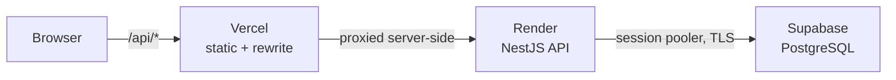

# Music School

**A management system for a music school - teachers, students, subjects and grades, with three levels of access.**

Students see their own subjects, grades and teachers. Teachers manage the students in the
subjects they teach and award grades. A head teacher additionally manages the school itself:
hiring teachers, enrolling students, and creating subjects. Awarding or changing a grade emails
the student automatically.

Built with NestJS, TypeORM and PostgreSQL on the backend, and React with Vite on the frontend.

## Live demo

|         |                                                |
| ------- | ---------------------------------------------- |
| Web app | https://music-school-eight-vert.vercel.app     |
| API     | https://music-school-api-coab.onrender.com/api |

- _The API is on Render's free plan, so it sleeps after about 15 minutes of inactivity. The first
  request after an idle period takes 30–60 seconds; everything after that is normal speed._

The demo database is seeded with the accounts below. All of them use the password
`password123`.

| Role         | Email                               | Can do                                               |
| ------------ | ----------------------------------- | ---------------------------------------------------- |
| Head teacher | `head.teacher@music-school.test`    | Everything, including managing teachers and subjects |
| Teacher      | `andriy.melnyk@music-school.test`   | Their own students and grades                        |
| Student      | `sofia.tkachenko@music-school.test` | Their own grades, subjects and teachers              |

## Features

| Feature             | What it does                                                                          |
| ------------------- | ------------------------------------------------------------------------------------- |
| Three roles         | Student, teacher and head teacher, each with a separate dashboard and route tree      |
| Subject enrolment   | A subject links many teachers and many students, per study year and semester          |
| Grades              | Teachers grade their students; students see only their own                            |
| Email notifications | A new or updated grade emails the student                                             |
| Teacher directory   | Head teacher hires, edits and removes teachers; experience is derived from start date |
| Student records     | Contact details, parent phone, address, enrolment date, study years                   |
| Password changes    | Students and teachers can change their own password                                   |
| Reporting filters   | Students filterable by enrolment period, with totals                                  |

## How authentication works

The interesting part of this codebase is that **there is no single users table**. Students and
teachers are separate entities with separate tables, and a role is not a column -it is
_which table you were found in_.

Login checks teachers first, then students, and derives the role from the row:

```ts
const role = teacher.isHeadTeacher ? Role.HeadTeacher : Role.Teacher;
```

The JWT carries `{ id, email, role }`. On every request `AuthMiddleware` decodes it and loads the
full record - but instead of attaching one `req.user`, it attaches one of three separate slots
and leaves the other two undefined:

```ts
req.student = student;
req.teacher = teacher;
req.headTeacher = headTeacher;
```

`RolesGuard` then asks which slot is filled:

```ts
if (request?.student?.id && requiredRoles.includes(Role.Student)) return true;
if (request?.teacher?.id && requiredRoles.includes(Role.Teacher)) return true;
if (request?.headTeacher?.id && requiredRoles.includes(Role.HeadTeacher))
  return true;
```

The trade-off: a controller can read `req.headTeacher` and know, with no further checks, that it
holds a head teacher - the types make the wrong role unreachable. The cost is that every new role
means a new slot on the request, and a head teacher is a teacher row, so `req.teacher` is
_undefined_ for them. Code that wants "any teacher" has to check both slots.

The middleware never throws. A bad or missing token simply leaves all three slots empty and
`next()` runs; `RolesGuard` is what rejects the request. So an endpoint with no `@Roles()`
decorator is public.

## Architecture



The browser only ever talks to the Vercel domain. Vercel rewrites `/api/*` to Render on the
server side, so requests are same-origin and CORS never comes into it.

## Tech stack

| Role          | Library                              |
| ------------- | ------------------------------------ |
| API framework | NestJS 11                            |
| ORM           | TypeORM 0.3                          |
| Database      | PostgreSQL 14 (local), 17 (Supabase) |
| Auth          | jsonwebtoken 9, bcrypt 6             |
| Email         | nodemailer 7                         |
| UI            | React 19, React Router 7             |
| Data fetching | TanStack Query 5, axios 1            |
| Styling       | Tailwind CSS 4                       |
| Build         | Vite 7, TypeScript 5                 |

## Project structure

```
.
├── backend/              NestJS API
│   └── src/
│       ├── auth/         Login, JWT issuing, role enum
│       ├── student/      Entity, service, controller, DTOs
│       ├── teacher/      Same, plus head-teacher flag
│       ├── subject/      Many-to-many with both of the above
│       ├── grade/        Grades, and the email hook on create/update
│       ├── guards/       RolesGuard
│       ├── middlewares/  AuthMiddleware
│       ├── migrations/   TypeORM migrations
│       ├── seeds/        Demo data
│       └── ormconfig.ts  DataSource, shared by the app and the CLI
├── frontend-react/       React app
│   └── src/
│       ├── auth/         Login page, AuthContext, ProtectedRoute
│       ├── students/     Student dashboard and forms
│       ├── teachers/     Teacher and head-teacher dashboards
│       ├── subjects/     Subject management
│       └── grades/       Grade management
├── docker-compose.yml    db + api + frontend
├── render.yaml           Render Blueprint for the API
└── DEPLOYMENT.md         Cloud setup in detail
```

## Running locally

**Prerequisites:** Docker Desktop, and Node.js 20 or newer if you want to run the seed from your
machine.

```bash
git clone https://github.com/kkatalz/music-school.git
cd music-school
cp .env.example .env
docker compose up --build   # app on :5173, API on :3000/api, Postgres on :5400
```

!!! `.env` must sit at the repository root, not in `backend/` - Docker Compose only reads `.env` from
the directory holding `docker-compose.yml`.

That starts all three services. Migrations run automatically when the API container starts. To
load the demo data:

```bash
cd backend && npm install && npm run db:seed
```

Then open http://localhost:5173 and log in with any account from the table above.

### Scripts

Run from `backend/`:

| Script                                              | What it does                                             |
| --------------------------------------------------- | -------------------------------------------------------- |
| `npm run start:dev`                                 | API with watch mode, outside Docker                      |
| `npm run build`                                     | Compile to `dist/`                                       |
| `npm test`                                          | Jest unit tests for the services                         |
| `npm run db:seed`                                   | Load demo data. Truncates first, so it is safe to re-run |
| `npm run migration:generate -- src/migrations/Name` | Generate a migration from entity changes                 |
| `npm run migration:run`                             | Apply pending migrations                                 |
| `npm run migration:revert`                          | Roll back the last one                                   |
| `npm run db:drop`                                   | Drop the whole schema                                    |

`migration:run` and `db:seed` use `ts-node`. Their `:prod` counterparts
(`migration:run:prod`, `db:seed:prod`) run the compiled output instead and are what Render uses.

### Environment variables


| Variable                                            | Purpose                                                           |
| --------------------------------------------------- | ----------------------------------------------------------------- |
| `POSTGRES_USER`, `POSTGRES_PASSWORD`, `POSTGRES_DB` | Credentials for the local Postgres container                      |
| `POSTGRES_PORT`                                     | Host port for Postgres. The container always uses 5432 internally |
| `PORT`                                              | Host port for the API                                             |
| `DATABASE_URL`                                      | Connection string used by migrations and seeds run from the host  |
| `DATABASE_SSL`                                      | `true` for managed Postgres. Leave unset locally                  |
| `JWT_SECRET`                                        | Signing key for auth tokens                                       |
| `FRONTEND_PORT`                                     | Host port for the Vite dev server                                 |

Inside Compose the API builds its own `DATABASE_URL` from the `POSTGRES_*` values against the
`db` service hostname, so the two cannot drift apart.

## API reference

All routes are prefixed with `/api`. Anything without a role listed is public.

| Method                | Route                                                                                    | Who                   |
| --------------------- | ---------------------------------------------------------------------------------------- | --------------------- |
| POST                  | `/auth/login`                                                                            | anyone                |
| GET                   | `/students` · `/students/:id` · `/students/total`                                        | anyone                |
| GET                   | `/students/:id/study-years` · `/students/:id/teachers` · `/students/:studentId/subjects` | anyone                |
| POST · PUT · DELETE   | `/students` · `/students/:id`                                                            | head teacher          |
| PATCH                 | `/students/password`                                                                     | student               |
| GET                   | `/teachers` · `/teachers/:id` · `/teachers/experience/:id`                               | anyone                |
| GET                   | `/teachers/:teacherId/students` · `/teachers/:teacherId/subjects`                        | anyone                |
| POST · PATCH · DELETE | `/teachers` · `/teachers/:id`                                                            | head teacher          |
| PATCH                 | `/teachers/password`                                                                     | teacher, head teacher |
| GET                   | `/subjects` · `/subjects/:id` · `/subjects/info`                                         | anyone                |
| POST · PATCH · DELETE | `/subjects` · `/subjects/:id`                                                            | head teacher          |
| POST · DELETE         | `/subjects/:id/teachers` · `/subjects/:id/students`                                      | head teacher          |
| POST · PUT            | `/grades` · `/grades/:id`                                                                | teacher, head teacher |
| GET                   | `/grades/student/:studentId` · `/grades/teacher/:teacherId`                              | teacher, head teacher |

## Limitations

- **SMTP credentials are hardcoded in `backend/src/mail/mail.service.ts`.** They belong in
  environment variables. Until that changes, treat the mailbox as compromised.
- **Every `GET` on `/students` and `/teachers` is unauthenticated.** None of the six read
  endpoints in `student.controller.ts` carries a `@Roles()` decorator, and the response includes
  the `password` column, so `GET /api/students` hands out bcrypt hashes, home addresses and
  parent phone numbers to anyone. The response DTOs need to drop `password` and the reads need
  role decorators.
- `AuthMiddleware` swallows token errors silently, so an expired token looks the same as no token
  and the client sees a generic 403.
- A head teacher fills `req.headTeacher` but not `req.teacher`, so "any teacher" checks must test
  both slots. Easy to get wrong when adding an endpoint.
- Jest covers the four services (44 tests); there are no controller or end-to-end tests.
- `frontend-react/README.md` is still the unmodified Vite template.

## About
 Built in team, backend was built by
[me - ZLata Karbovska](https://github.com/kkatalz).

Cloud setup - Supabase, Render and Vercel - is documented in [DEPLOYMENT.md](DEPLOYMENT.md).
